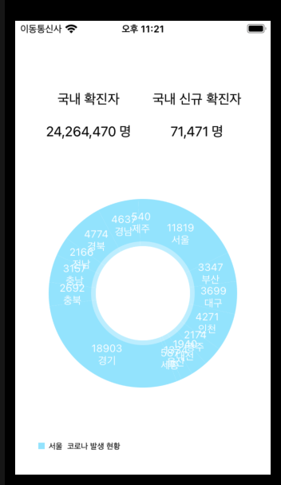
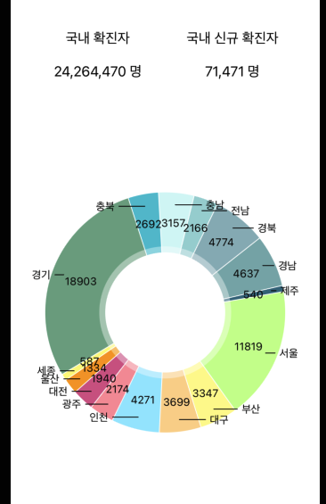
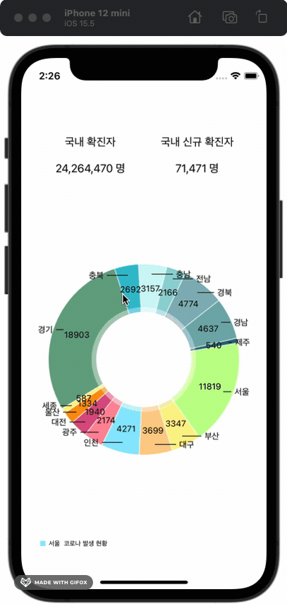
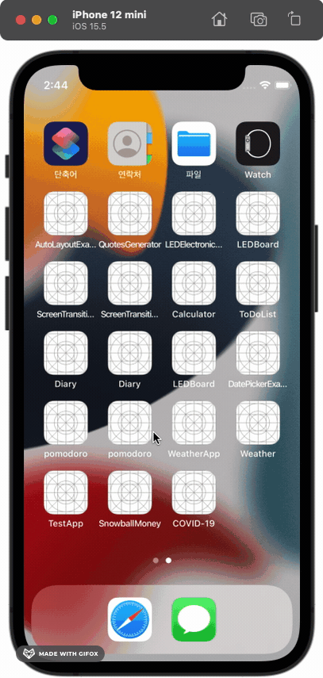

# About
- Corona API를 활용해 데이터 받아오고 데이터 Pie Chart에 구현

# Skills & Tech Stack
- 굿바이 코로나 19 API 
- Alamofire 
- Cocoapods

# Development Process 
1. 데이터 받아와서 Chart 구현
 
2. 차트 UI 변경 
 
3. 차트 클릭시 Detail View 보이게 구현
 
4. indicator 추가(잘 안보임)
 
