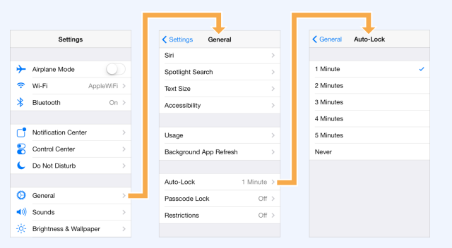
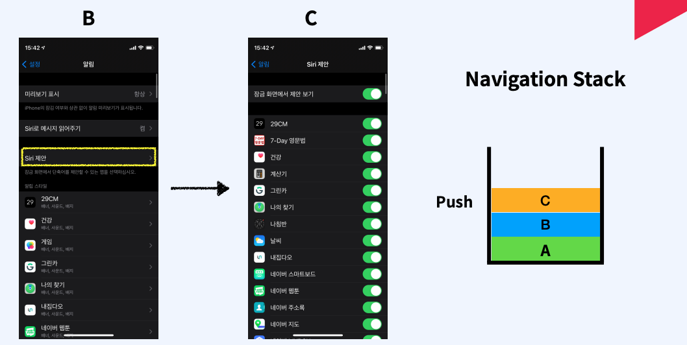
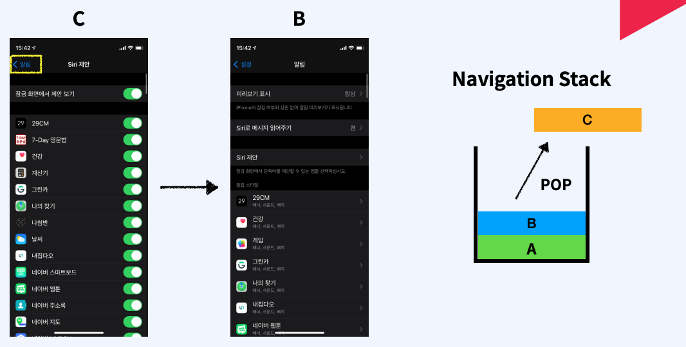
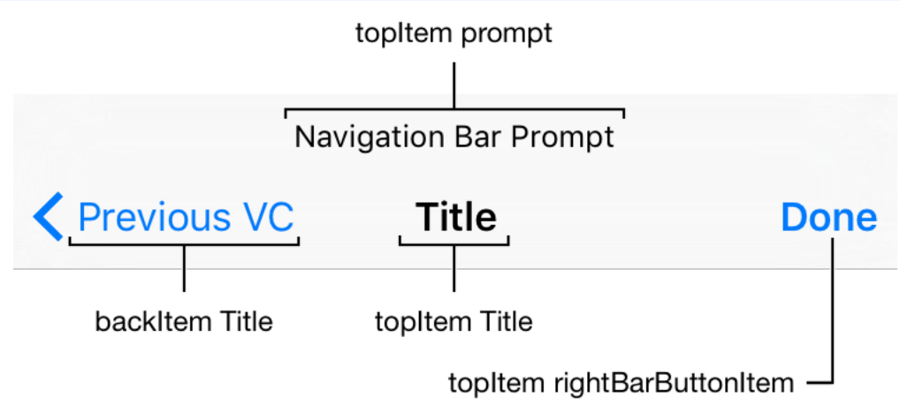

# 활용기술
- UINavigationController 
- 화면 전환 개념 
- ViewController Life Cycle 
- 화면간 데이터 전달 하는 방법 
- 에셋 카탈로그

# Content View Controller
- 화면을 구성하는 뷰를 직접 구현하고 관련된 이벤트를 처리하는 뷰 컨트롤러

# Container View Controller
- 하나 이상의 Child View Controller 를 가지고있음
- 하나 이상의 Child View Controller 를 관리하고 레이아웃과 화면 전환을 담당함
- 화면 구성과 이벤트 관리는 Child View Controller 에서 함
- Container View Controller 는 대표적으로 Navigation Controller 와 TabBar Controller가 있음

## Navigation Stack
Last in First Out 구조를 가짐 

 

## Navigation Bar 구성
Navigation Controller로 구현할시 화면 상단에 항상 보여짐

