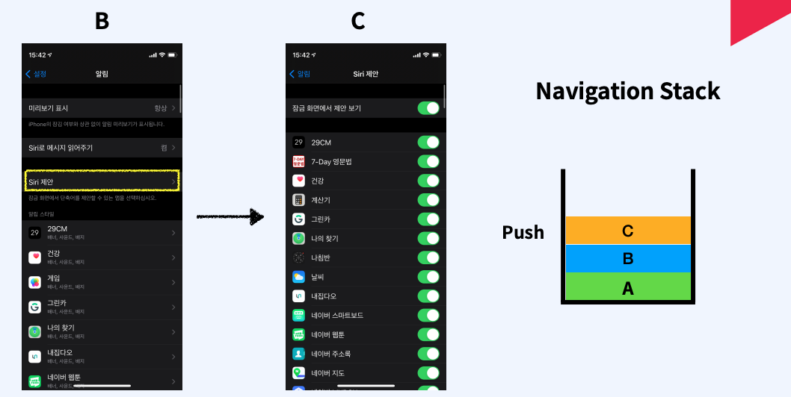
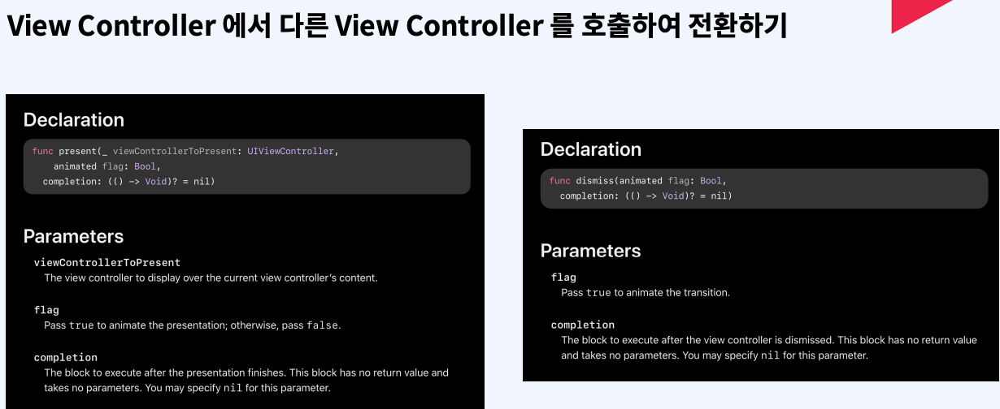
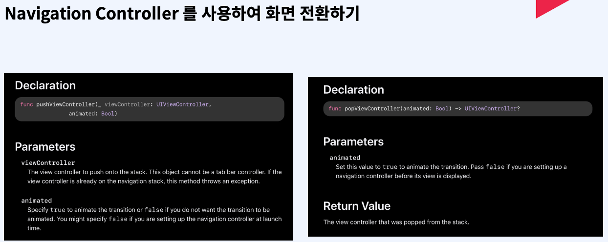

# 활용기술
- UINavigationController 
- 화면 전환 개념 
- ViewController Life Cycle 
- 화면간 데이터 전달 하는 방법 
- 에셋 카탈로그

# Content View Controller
- 화면을 구성하는 뷰를 직접 구현하고 관련된 이벤트를 처리하는 view controller

# Container View Controller
- 하나 이상의 Child View Controller 를 가지고있음
- 하나 이상의 Child View Controller 를 관리하고 레이아웃과 화면 전환을 담당함
- 화면 구성과 이벤트 관리는 Child View Controller 에서 함
- Container View Controller 는 대표적으로 Navigation Controller 와 TabBar Controller가 있음

## Navigation Stack
Last in First Out 구조를 가짐 

 

## Navigation Bar 구성
Navigation Controller로 구현할시 화면 상단에 항상 보여짐

# 화면 전환 방법
- View Controller 의 View 위에 다른 View를 가져와 바꿔치기 (권고되지 않음, 메모리 누수 발생)
- View Controller에서 다른 View Controller 를 호출하여 전환하기
- Navigation Controller 를 사용하여 화면 전환하기
- 화면 전환용 객체 세그웨이(Segueway) 를 사용하여 화면 전환하기
## 다른 View Controller 호출하는 방식(프레젠테이션 방식)
### present 메서드
첫번째 파라미터에는 새로운 화면으로 이동할 화면의 view Controller 인스턴스를 넣어줌 
두 번째 파라미터는 애니메이션 효과를 줄건지 안줄건지 Boolean값으로 넣어줌 
세 번째 미터는 클로저를 정의해주면 화면 전환이 완료되는 시점에 Completion 클로저가 호출됨, 화면 전환 후 처리해줘야 할 로직이 있을 때 사용 

### dissmiss 메서드
이전화면으로 돌아가는 기능   
돌아가는 기능이기 때문에 view controller의 인스턴스를 인자로 전달받지 않음  
첫 번째 파라미터에는 이전 화면으로 돌아갈 때 애니메이션을 넣을지 말지 Boolean 값으로 전달 
두 번째 파라미터는 이전 화면으로 전환이 완료되는 시점에 호출될 Completion 클로저를 정의함

## Navigation Controller

### pushViewController
네비게이션 스택에 화면을 추가하는 메서드 
첫 파라미터에는 view controller의 인스턴스, 두 번째는 애니메이션 사용 여부
### popViewController
네비게이션 스택에 화면을 제거하는 메서드 
view controller의 인스턴스 값을 인자로 받지 않으며, 첫 파라미터에 애니메이션 사용 여부만 인자로 받음

## Segueway
스토리보드를 통해 직접 출발지와 목적지를 지정함 
### Action Segueway
출발점이 Button인 경우
### Manual Segueway
출발점이 View Controller 자체인 경우 
### ActionSegueway 종류
- Show
-- 가장 일반적인 세그웨이
- Show Detail
-- 아이패드에서 스플릿 된 화면 구현
- Present Modally
-- 프레젠테이션 방식으로 화면 전환
- Present As Popover
-- 아이패드에서 팝업창 띄움
- Custom
-- 사용자가 원하는 방식대로 세그웨이를 커스텀 함

