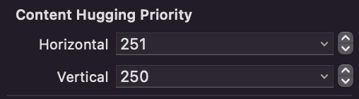
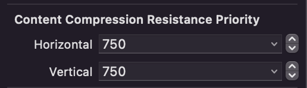

# 활용기술
- Storyboard
- AutoLayout
- UILabel
- UIButton

# 컨텐츠 고유 사이즈 변경
Size inspector 에서 확인
## Content Hugging Priority 
우선 순위가 높으면 내 크기 유지, 우선순위 낮으면 크기 늘어남 

## Compression Resistance Priority 
우선 순위가 높으면 내 크기 유지, 우선순위 낮으면 크기 작아짐 

# Attribute Inspector
- lines : 0으로 설정하면 여러 줄이 표시됨
