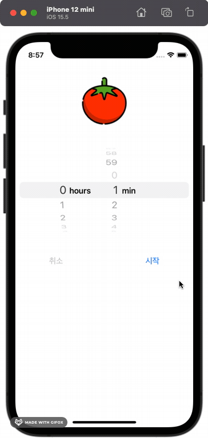

# Features
- 시간 설정이 가능한 포모도로 타이머

# Skills & Tech Stack
- DispatchSourceTimer 
- UIView Animation

# Development Process
1. UI 구성
2. Button 클릭시 화면 구성
3. Timer 기능 구현 
4. Timer의 시간에 따라 Label 바꾸고 Progress의 게이지도 바꿔줌 
4.1. 알람소리 넣어줌 
4.2. 애니메이션 효과 넣어줌

# Result

